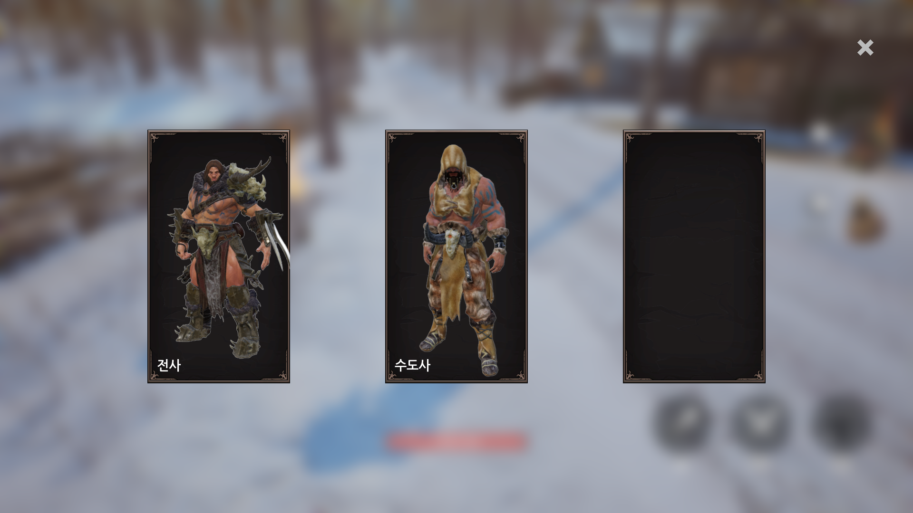
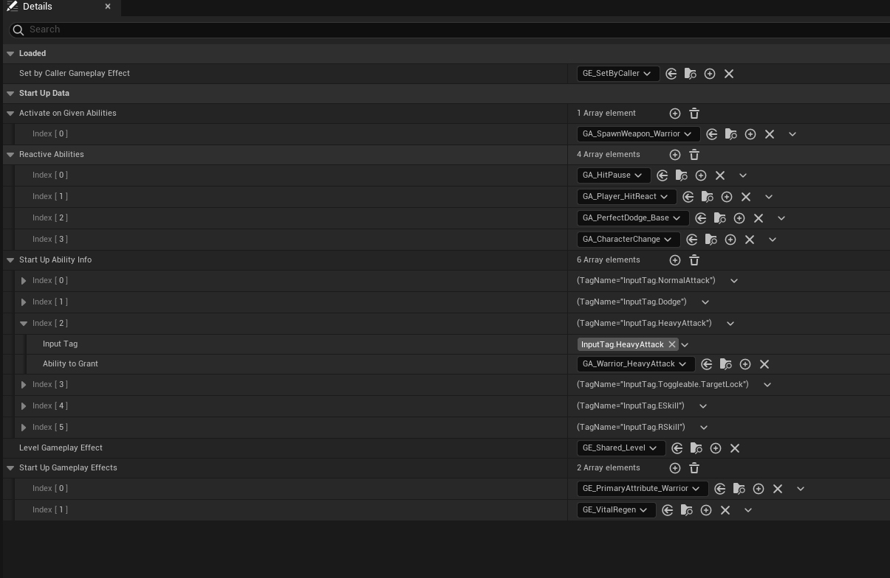
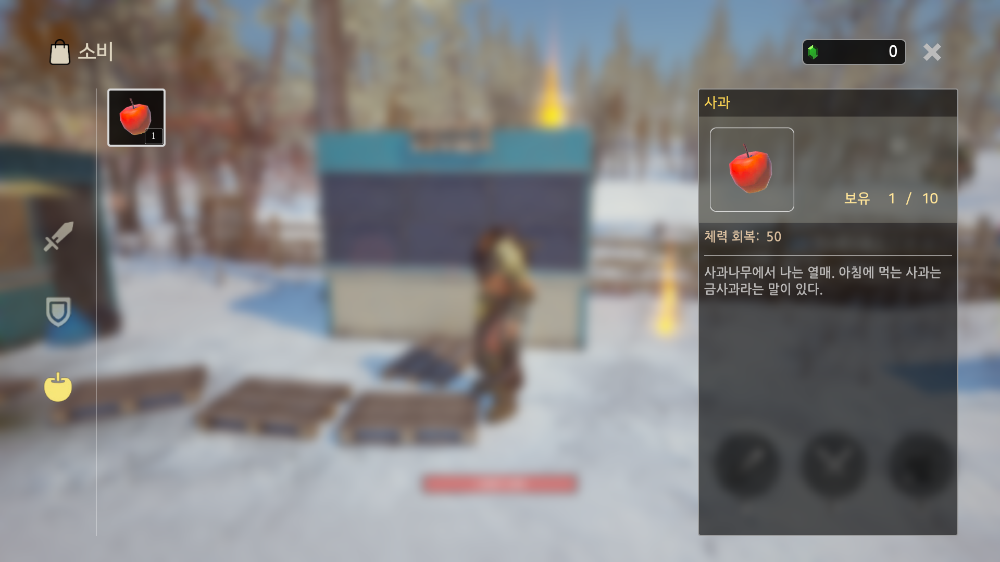
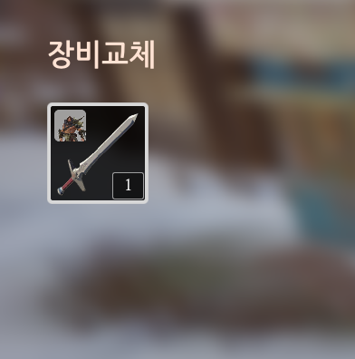
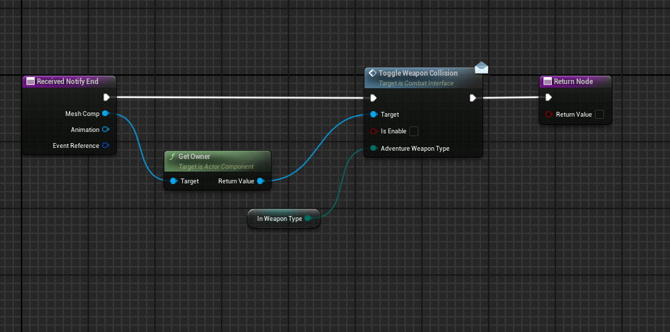
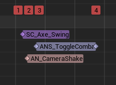
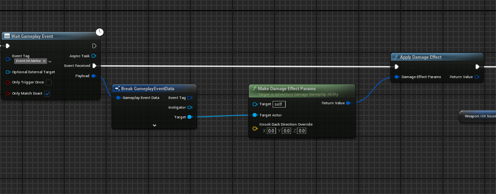
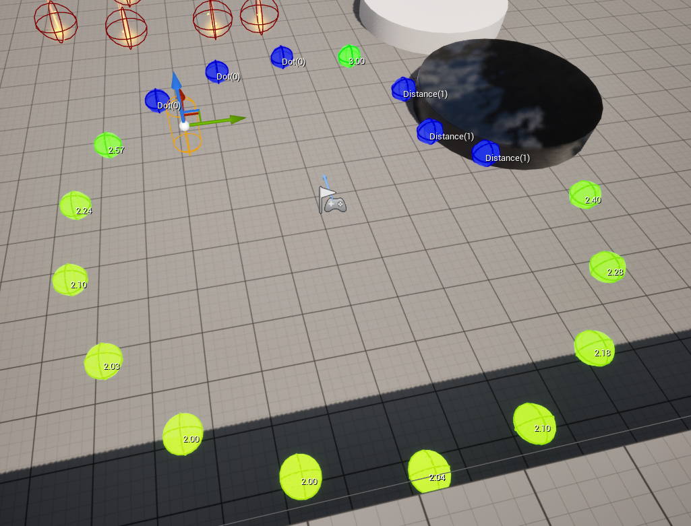

## 0. 목차
- [0. 목차](#0-목차)
- [1. 개요](#1-개요)
- [2. 프로젝트 요약](#2-프로젝트-요약)
- [3. 핵심 기능 및 구현 내용](#3-핵심-기능-및-구현-내용)
  - [3.1 캐릭터 스위칭 시스템](#31-캐릭터-스위칭-시스템)
  - [3.2 인벤토리 시스템](#32-인벤토리-시스템)
  - [3.3 클라이밍 시스템](#33-클라이밍-시스템)
  - [3.4 전투 시스템](#34-전투-시스템)
- [4. 고찰 및 회고](#4-고찰-및-회고)

## 1. 개요
- **프로젝트 소개**:  
  - 오픈 월드 기반의 **캐릭터 스위칭 액션 RPG 게임**.
- **개발 인원**:  
  - 1인 개발
- **사용 엔진**:  
  - Unreal Engine 5.4.4

- **작업 기간**:  
  - 2025년 3월 27일 ~ 2025년 5월 16일 (약 2개월)
---
## 2. 프로젝트 요약

- **장르**:  
  3D 액션 RPG

- **게임 특징**:  
  인기 모바일 게임인 **명조**, **원신**처럼 파티를 구성하고, 캐릭터를 스위칭하면서 적을 처치하고 재화를 모아 레벨업하는 **오픈 월드 액션 RPG** 게임입니다.

- **플레이 영상**:  
  ▶ [YouTube](https://www.youtube.com/watch?v=9Dc6Iqsmx_s)

- **주요 기능 요약**:

  - **파티 시스템**  
  `Party Manager` 클래스를 통해 캐릭터들의 정보를 저장하고 파티를 구성합니다.

  - **캐릭터 스위칭**  
    `Gameplay Ability` 시스템을 활용하여 파티 인덱스에 매칭된 키보드 버튼을 눌러 캐릭터를 실시간 전환할 수 있습니다.
  - **개별 능력치**
    `Data Asset`과 `Data Table`을 통하여 캐릭터마다 **고유한 Attribute와 Ability를 부여**하였습니다.

  - **인벤토리 시스템**  
    아이템을 습득하고 장비할 수 있으며, 이를 통해 **체력을 회복**하거나 **공격력/방어력**을 향상시킬 수 있습니다.

  - **Climbing 시스템**  
    `Line Trace`를 이용하여 장애물을 판단하고, 해당 높이에 맞는 행동을 실행합니다.

  - **MVC 패턴**
    `Model-View-Controller Pattern`을 사용하여 **Model**(데이터)과 **View**(위젯)가 바로 연결되는 것이 아니라 **Controller**를 통해 정보를 주고받습니다.
---
## 3. 핵심 기능 및 구현 내용
### 3.1 캐릭터 스위칭 시스템


- **CharacterManager Class**
  > GitHub Link: 
  > - [CharacterManager.h](https://github.com/jinjinchoi/OpenWorldRPGGame/blob/main/Source/Adventure/Public/GameManager/ControllableCharacterManager.h)
  > - [CharacterManager.cpp](https://github.com/jinjinchoi/OpenWorldRPGGame/blob/main/Source/Adventure/Private/GameManager/ControllableCharacterManager.cpp)
  > - [PartyCharacterInfo](https://github.com/jinjinchoi/OpenWorldRPGGame/blob/main/Source/Adventure/Public/AdventureType/AdventureStructTypes.h#L58)

  캐릭터 매니저 클래스에서는 캐릭터 및 파티 정보를 가지고 있습니다.

  ```c++
  protected:
      // 캐릭터 클래스 정보를 약한 참조(Soft Reference)로 저장.
    UPROPERTY(EditDefaultsOnly)
    TMap<FGameplayTag, TSoftClassPtr<ACharacter>> CharacterClassInfoMap;
    
      // 캐릭터마다 기본 능력치를 저장
    UPROPERTY(EditDefaultsOnly)
    TArray<FPartyCharacterInfo> DefaultCharacterInfos;
    
      // 현재 소유하고 있는 캐릭터 능력치 저장
    UPROPERTY()
    TArray<FPartyCharacterInfo> OwningCharacters;

      // 인덱스와 Gameplay Tag를 통하여 파티 멤버 저장
    UPROPERTY()
    TMap<int32 /* Party index */, FGameplayTag /* Character Tag */> PartyCharacterInfo;
  ```

  위의 코드는 캐릭터 매니저 클래스의 일부분으로 캐릭터들의 정보는 `PartyCharacterInfo` 구조체에 저장되어 있으며 에디터에서 쉽게 설정이 가능합니다. 또한 캐릭터 클래스는 **약한 참조**를 하여 사용하지 않는 캐릭터가 **불필요하게 메모리를 차지하는 것을 방지**하였습니다.
<br>

- **ChangeCharacterAbility**
  > GitHub Link:
  > - [ChangeCharacterAbility.h](https://github.com/jinjinchoi/OpenWorldRPGGame/blob/main/Source/Adventure/Public/AbilitySystem/Abilities/AdventureChangeCharacterAbility.h)
  > - [CharacterAbility.cpp](https://github.com/jinjinchoi/OpenWorldRPGGame/blob/main/Source/Adventure/Private/AbilitySystem/Abilities/AdventureChangeCharacterAbility.cpp)

  아래는 Gameplay Ability 시스템을 이용해 캐릭터를 변경하는 로직의 일부분입니다.

  ```c++
  // 파티 캐릭터 목록에서 캐릭터 인포를 가져옴
  CachedCharacterIndex = InCharacterIndex;
  if (const FPartyCharacterInfo* FoundCharacterInfo = CharacterManager->FindCharacterInfoByPartyIndex(InCharacterIndex))
  {
      CachedPartyInfo = *FoundCharacterInfo;
  }

  // ... (매니저에 현재 캐릭터의 정보를 저장)

  // Soft Object Load 후 작업 시작
  CharacterManager->GetCharacterClassByTag(CachedPartyInfo.ClassTag, [this](TSubclassOf<ACharacter> LoadedClass)
  {
    // ... (Spawn 위치 설정)
      
    if (LoadedClass)
    {
  
      // ... (기존 캐릭터의 Controller Rotation, Movement 등을 변수에 저장)

      // 소환 후 Possess
      SpawnedCharacter->FinishSpawning(SpawnTransform);
      CurrentActorInfo->PlayerController->Possess(SpawnedCharacter);

      // ... (새 캐릭터에 기존 캐릭터의 위치나 Movement Mode 등을 설정)

      if (GetAvatarActorFromActorInfo())
      {
          GetAvatarActorFromActorInfo()->SetLifeSpan(0.1);
      }
    }
  });

  ```

  기본 로직은 다음과 같습니다.
  캐릭터 매니저 클래스에서 인덱스를 통해 변경할 캐릭터 정보를 불러오고 현재 조종하고 있던 캐릭터의 정보를 저장합니다. 변경할 캐릭터의 클래스 태그를 통해 `CharacterClassInfoMap`에서 캐릭터 클래스를 **비동기 로드**합니다.
  비동기 방식의 로드를 통하여 게임 실행 중 끊김 없이 캐릭터 변경이 자연스럽게 이루어지도록 구현하였습니다.
<br>

- **PlayerCamera Actor**
  > GitHub Link:
  > - [PlayerCamera.h](https://github.com/jinjinchoi/OpenWorldRPGGame/blob/main/Source/Adventure/Public/Actor/Camera/AdventurePlayerCamera.h)
  > - [PlayerCamera.cpp](https://github.com/jinjinchoi/OpenWorldRPGGame/blob/main/Source/Adventure/Private/Actor/Camera/AdventurePlayerCamera.cpp)

  캐릭터를 변경할 때 Camera Lag을 사용하면 카메라가 부자연스럽게 튀는 현상이 나타났습니다. 이를 방지하기 위해 캐릭터에 카메라를 설정하는 것이 아닌 카메라를 가지고 있는 액터를 따로 만들었고 Player Controller에서 이 액터에 View Target을 주어 카메라가 튀는 현상을 방지하였습니다.
  <br>

- **StartupData Asset**

캐릭터마다 Ability와 Attribute를 설정하는 데이터 에셋을 구현하여 각각의 캐릭터마다 고유한 능력들을 부여합니다.

---

### 3.2 인벤토리 시스템



- **Inventory**
  > GitHub Link:
  > - [Inventory.h](https://github.com/jinjinchoi/OpenWorldRPGGame/blob/main/Source/Adventure/Public/Player/AdventureInventory.h)
  > - [Inventory.cpp](https://github.com/jinjinchoi/OpenWorldRPGGame/blob/main/Source/Adventure/Private/Player/AdventureInventory.cpp)

  아래는 인벤토리 클래스의 일부분으로 배열에 각각의 아이템 정보들을 저장하는 방식으로 인벤토리를 구현하였습니다.

  ```c++
  // Inventory.h

  USTRUCT(BlueprintType)
  struct FAllItem
  {
    GENERATED_BODY()

    UPROPERTY(BlueprintReadOnly)
    TArray<FItemSlot> Swords;
    
    UPROPERTY(BlueprintReadOnly)
    TArray<FItemSlot> Shields;
    
    UPROPERTY(BlueprintReadOnly)
    TArray<FItemSlot> Eatables;
    
  };

  UCLASS(Blueprintable)
  class ADVENTURE_API UAdventureInventory : public UObject
  {
    GENERATED_BODY()

  public:
    void AddPickupsToAllItems(const FItemSlot& NewItem);
    
    UPROPERTY(BlueprintReadOnly)
    FAllItem AllItems;

      // ... 생략

  }
  ```

  아래는 FItemSlot 구조체의 모습입니다.
  ```c++
  USTRUCT(BlueprintType)
  struct FItemSlot
  {
    GENERATED_BODY()

    // 아이템 태그
    UPROPERTY(BlueprintReadOnly)
    FGameplayTag ItemTag = FGameplayTag();

    // 아이템의 수
    UPROPERTY(BlueprintReadOnly)
    int32 Quantity = 0;

    // 장착하고 있는 캐릭터 태그
    UPROPERTY(BlueprintReadOnly)
    FGameplayTag EquippedCharacterTag = FGameplayTag();

    // 아이템의 고유 아이디
    UPROPERTY(BlueprintReadOnly)
    FGuid SlotID;
    
  };
  ```
  `ItemTag`를 통해 DataAsset에서 아이템의 정보를 가져오며  `EquippedCharacterTag` 통해 현재 장착 중인 캐릭터를 구분합니다. 이를 통해 **중복 아이템 착용을 방지**하고 **UI에 장착 중인 캐릭터를 표시**해 줍니다.
  - 이미지 예시
  
  <br>
- **Item**
  > GitHub Link:
  > - [Item.h](https://github.com/jinjinchoi/OpenWorldRPGGame/blob/main/Source/Adventure/Public/Item/Pickups/AdventureInventoryItem.h)
  > - [Item.cpp](https://github.com/jinjinchoi/OpenWorldRPGGame/blob/main/Source/Adventure/Private/Item/Pickups/AdventureInventoryItem.cpp)

  아래 코드는 Pickup Item 클래스의 일부분입니다. Pickup Item은 월드에서 획득할 수 있는 아이템을 말하며 태그를 설정하여 구분합니다.
  ```c++
  public:	
    AAdventureInventoryItem();

    // 아이템을 구분하는 태그
    UPROPERTY(EditAnywhere, BlueprintReadOnly, Category = "Item Info", meta=(Categories = "Item"))
    FGameplayTag ItemTag;

    // 아이템의 수량
    UPROPERTY(EditAnywhere, BlueprintReadOnly, Category = "Item Info")
    int32 Quantity = 1;
  ```
  아이템을 표시할 때는 Widget Controller에 플레이어 캐릭터와 오버랩된 아이템의 태그를 보내고 위젯 컨트롤러에서는 이 태그를 바탕으로 아이템의 정보를 가져온 뒤 위젯에 보냅니다. 그 후 위젯에서 이 정보를 Overlay에 보여주는 방식으로 구현하였습니다.

---

### 3.3 클라이밍 시스템

 - **Custom Movement Component**
    > GitHub Link:
    > - [MovementComponent.h](https://github.com/jinjinchoi/OpenWorldRPGGame/blob/main/Source/Adventure/Public/Component/Movement/AdventureMovementComponent.h)
    > - [MovementComponent.cpp](https://github.com/jinjinchoi/OpenWorldRPGGame/blob/main/Source/Adventure/Private/Component/Movement/AdventureMovementComponent.cpp)
    
커스텀 무브먼트 컴포넌트를 만들어 CharacterMovementComponent를 대체하였고 이곳에서 Climbing 작업을 진행합니다.

아래 코드는 클라이밍이 가능한지 확인하는 함수의 코드입니다.
```c++

bool UAdventureMovementComponent::CanStartClimbing()
{
  // 공중에 있는지 확인
  if (IsFalling()) return false;
  // 등반 가능한 표면이 있는지 확인
  if (!TraceClimbableSurfaces()) return false;
  // 눈 높이에 벽이 있는지 확인
  if (!TraceFromEyeHeight(100.f).bBlockingHit) return false;
  // 한번에 뛰어 넘을 수 있는 높이인지 확인
  if (!TraceFromEyeHeight(100.f, MountTraceOffset).bBlockingHit) return false;

  return true;
	
}
```
클라이밍 기능은 단순히 벽을 타는 데서 끝이 아니라 벽의 높이를 평가하여 그에 맞는 액션을 취하게 됩니다. 또한 Movement Mode의 변경을 확인하여 UI에 아이콘을 바꿔 표시하고 이러한 기능을 통해 플레이어에게 더 나은 경험을 선사합니다.
이어서 아래의 코드는 캐릭터를 벽에 붙게 하는 함수입니다.
```c++
void UAdventureMovementComponent::SnapMovementToClimbableSurfaces(float DeltaTime)
{
  const FVector ComponentForward = UpdatedComponent->GetForwardVector();
  const FVector ComponentLocation = UpdatedComponent->GetComponentLocation();

  // 백터 투영을 통해 벽과 캐릭터 사이의 거리 계산
  const FVector ProjectedCharacterToSurface = (CurrentClimbableSurfaceLocation - ComponentLocation).ProjectOnTo(ComponentForward);

  // 위의 계산한 거리를 바탕으로 캐릭터를 벽으로 얼마나 당겨야 하는지 계산
  const FVector SnapVector = -CurrentClimbableSurfaceNormal * ProjectedCharacterToSurface.Length();

  // 계산된 거리만큼 이동
  UpdatedComponent->MoveComponent(
    SnapVector * DeltaTime * MaxClimbSpeed,
    UpdatedComponent->GetComponentQuat(),
    true
  );

}
```
> GitHub Link:
> - [PhysCustom 함수의 내부에서 실행하고 있는 PhysClimb 함수](https://github.com/jinjinchoi/OpenWorldRPGGame/blob/main/Source/Adventure/Private/Component/Movement/AdventureMovementComponent.cpp#L205)

`CurrentClimbableSurfaceLocation`과 같은 변수는 또 다른 함수에서 트레이스를 통해 구하였고 이렇게 구한 표면들과 캐릭터의 위치를 계산하여 캐릭터가 벽에 붙어 있게 합니다. 해당 함수는 Character Movement Component Class에 있는 `PhysCustom()` 함수를 오버라이드하여 계속해서 실행시키고 있습니다.
PhysCustom() 함수에서는 벽에 붙이는 작업 외에도 표면을 계속 트레이스하고 바닥이나 꼭대기에 올랐는지도 확인하여 클라이밍 상태를 유지해야 하는지 아닌지를 판단합니다.

- Stamina System
클라이밍이나 전력질주 상태에 진입하면 Gameplay Effect를 적용하여 스태미나를 지속적으로 소모하게 하였고, Attribute Set 클래스에서 스태미나를 전부 소진한 것을 확인하면 캐릭터 클래스에 있는 함수를 호출하여 클라이밍/전력질주 상태를 해제합니다.

---

### 3.4 전투 시스템
- **Apply Damage**
대미지를 적용하는 로직을 간단하게 설명하면 다음과 같습니다. `Target 획득 -> Damage Effect Parms 생성-> Gameplay Effect 적용.`
이제 근접 공격을 예시로 자세히 알아보겠습니다.

  
  

  공격 Ability가 실행되면 애니메이션이 재생되고 이곳에서 Anim Notify State를 통해 무기의 콜리전을 설정합니다. 그 후 무기에 적이 오버랩되면 `SendGameplayEventToActor` 함수를 통해 해당 적에 대한 정보를 넘깁니다. 이후 Damage Effect Param을 설정한 후 대미지를 적용합니다.

  

  Damage Effect Param 구조체는 타겟이나 Gameplay Effect, 데미지 배율, Hit Direction 등을 저장하며 자세한 구조는 아래와 같습니다.
  > GitHub Link:
  > - [FDamageEffectParams 전체 구조](https://github.com/jinjinchoi/OpenWorldRPGGame/blob/main/Source/Adventure/Public/AdventureType/AdventureStructTypes.h#L18)
  ```c++
  USTRUCT(BlueprintType)
  struct FDamageEffectParams
  {
    GENERATED_BODY()

    FDamageEffectParams(){}

    UPROPERTY()
    TObjectPtr<UObject> WorldContextObject = nullptr;

    UPROPERTY()
    TSubclassOf<UGameplayEffect> DamageGameplayEffectClass = nullptr;

    UPROPERTY()
    TObjectPtr<UAbilitySystemComponent> SourceAbilitySystemComponent = nullptr;
    
    //... 이하 생략
  }
  ```

  이 구조체를 [`MakeDamageEffectParams`(Code Link)](https://github.com/jinjinchoi/OpenWorldRPGGame/blob/main/Source/Adventure/Private/AbilitySystem/Abilities/AdventureDamageGameplayAbility.cpp#L10) 함수에서 생성합니다. 이후 [`ApplyDamageEffect`(Code Link)](https://github.com/jinjinchoi/OpenWorldRPGGame/blob/main/Source/Adventure/Private/AdventureFunctionLibrary.cpp#L186)함수에서 Gameplay Effect를 적용합니다.
  이와 같은 작업을 통해 공격 Ability를 만들 때 **타겟만 구하면** 쉽게 **데미지를 적용**할 수 있어 손쉽게 새로운 Ability를 구현할 수 있게 되었습니다.
<br>
- **Damage Calculation**
  > GitHub Link:
  > - [ExecCalc_Damage.h](https://github.com/jinjinchoi/OpenWorldRPGGame/blob/main/Source/Adventure/Public/AbilitySystem/ExecCalc/ExecCalc_Damage.h)
  > - [ExecCalc_Damage.cpp](https://github.com/jinjinchoi/OpenWorldRPGGame/blob/main/Source/Adventure/Private/AbilitySystem/ExecCalc/ExecCalc_Damage.cpp)

  대미지는 커스텀 Calculation 클래스에서 계산됩니다. 해당 클래스에서는 Attribute를 캡처하여 공격력이나 방어력, 치명타 확률 등을 계산하여 최종 대미지를 설정합니다.
<br>
- **Enemy AI**
에너미의 AI는 Behavior Tree를 통해 구현하였습니다. 에너미는 적(플레이어)을 시야(AISenseConfig_Sight) 또는 대미지 피해(AISenseConfig_Damage)로 감지합니다. Behavior Tree에서 타겟이 생성되면 적에게 다가가 공격을 하며 이때 단순히 계속 적을 쫓아가는 것이 아니라 EQS를 통해 공격 후 적절한 플레이어 주변을 돌아다니는 행동을 진행합니다.

  
  <br>
- **Enemy Spawn**

  > GitHub Link:
  > - [SpawnVolume.h](https://github.com/jinjinchoi/OpenWorldRPGGame/blob/main/Source/Adventure/Public/Actor/SpawnSystem/AdventureEnemySpawnVolume.h)
  > - [SpawnVolume.cpp](https://github.com/jinjinchoi/OpenWorldRPGGame/blob/main/Source/Adventure/Private/Actor/SpawnSystem/AdventureEnemySpawnVolume.cpp)
  > - [SpawnPoint.h](https://github.com/jinjinchoi/OpenWorldRPGGame/blob/main/Source/Adventure/Public/Actor/SpawnSystem/AdventureEnemySpawnPoint.h)
  > - [SpawnPoint.cpp](https://github.com/jinjinchoi/OpenWorldRPGGame/blob/main/Source/Adventure/Private/Actor/SpawnSystem/AdventureEnemySpawnPoint.cpp)

  Enemy Spawn은 `Spawn Volume`과 `Spawn Point` 액터를 구현하여 스폰 볼륨에 플레이어가 들어오면 스폰 타겟에 설정된 에너미를 스폰 합니다. 이때 Enemy Class는 Soft Class로 설정하여 메모리 낭비를 방지하였습니다.

---

## 4. 고찰 및 회고
- 프로젝트를 통해 3D RPG 게임을 익힐 수 있었으며 특히 캐릭터의 소유의 개념에 대해 확실히 알 수 있었습니다.
- 한 가지 아쉬운 점은 현재 캐릭터를 생성하고 필요 없어지면 삭제(Destroy)하는 방식을 사용하였는데 이러한 방식이 매우 비효율적이라는 것을 알게 되었습니다.
- 차후 프로젝트 진행시 Object Pool을 활용하여 캐릭터를 제거하는 것이 아니라 Pool에 저장해 놓았다가 정말 필요하지 않은 시점이 오면 제외하는 방식으로 구현하려고 합니다.
- 이러한 아쉬운 점도 있었지만 이번 프로젝트는 스스로 구현하는 것을 중점으로 삼았으며 덕분에 자신감과 언리얼 엔진에 대한 지식을 얻을 수 있었습니다.

**<p align="center"> 감사합니다.</p>**